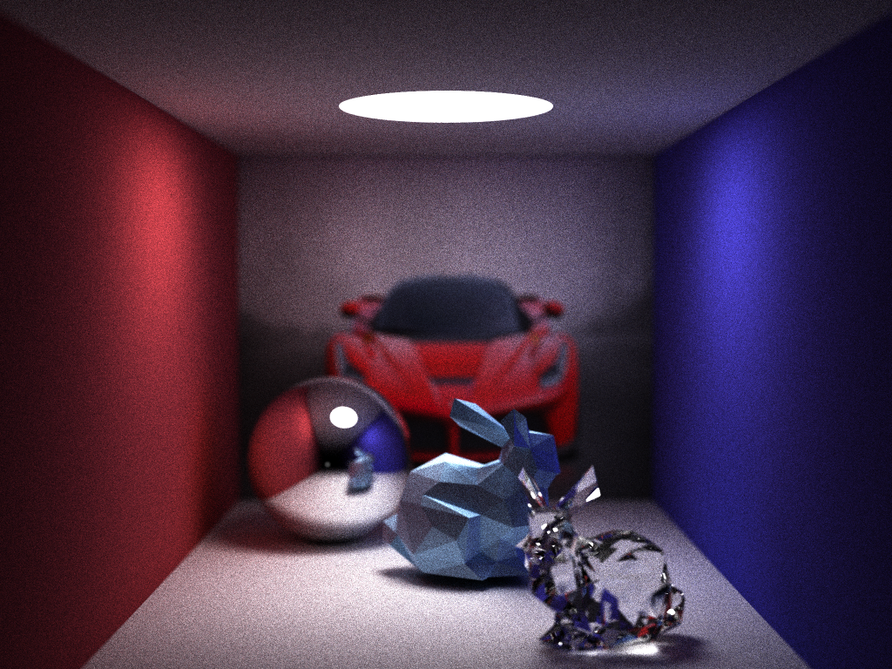
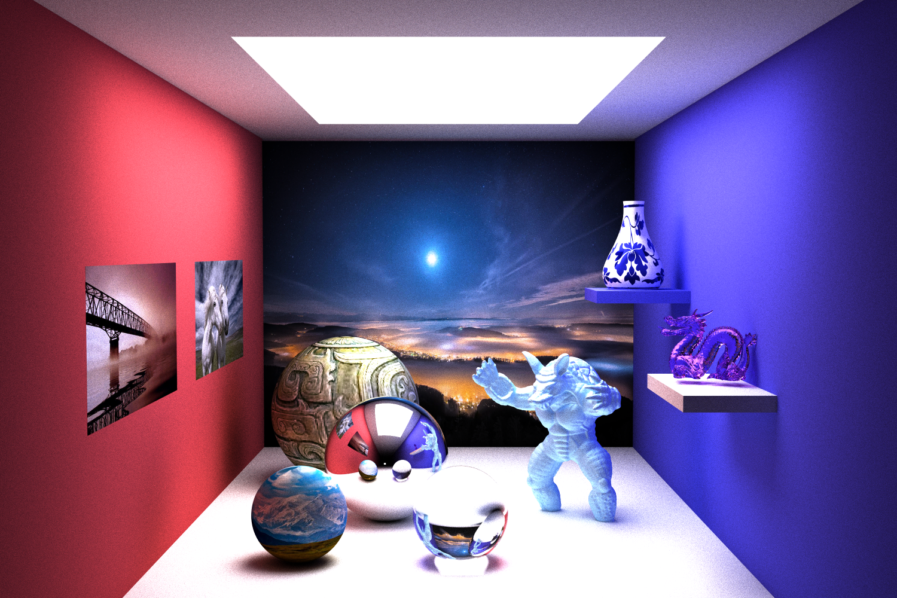
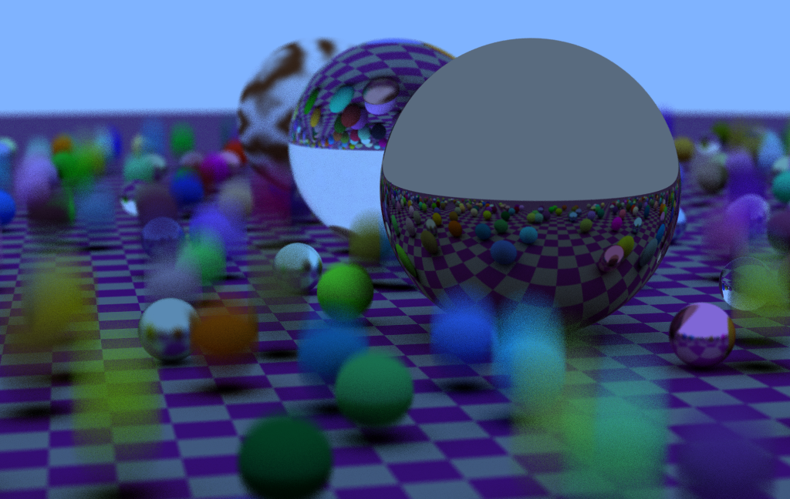
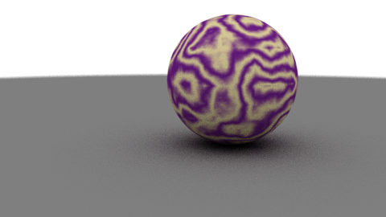
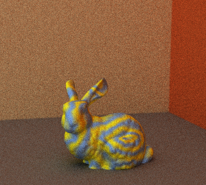
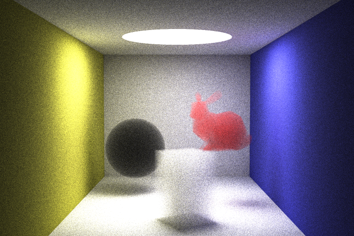

# Ray-Tracer
《计算机图形学》课程大作业：图像渲染引擎

算法选择：path tracing（路径追踪）

实现功能：景深、动态模糊、纹理映射、烟雾效果、层次包围体加速

### 一、简介与效果

在本次作业中，我使用路径追踪算法（Path Tracing）实现了真实感图像渲染的任务。程序读入指定格式书写的txt输入文件，输出指定图片格式（ppm、jpg、png等）的图片。实现的全部功能包括：反射与折射、纹理映射、三角网格模型的支持、根据凸透镜原理实现了相机的变焦变光圈的景深效果、运动模糊、通过超采样实现了抗锯齿效果、烟雾体积光的效果、轴对齐包围盒（AABB）和层次包围体（BVH）的求交加速、硬件上的OpenMP加速。

渲染效果如下。

注：第一张图展示了景深效果；第二张图的球描绘的是一些动物形象；第三张图正前方的是一个玻璃珠，因为上方灯光较强所以上面显得比较白；在mixed_scene的另一版本中，这个珠子是一个被贴成彩色的漫反射的球（见result）文件夹。

### 二、算法选择

本次实验中，只实现了Path Tracing（PT）一种光线追踪算法。在这一算法中，光线从相机内发出，经过场景中物体的不断反射折射，如果能在规定步数内到达光源，则从光源沿原路返回，依次乘以每个焦点的反射或折射率，作为这一点像素的颜色。

### 三、细节说明

#### 1、景深和运动模糊(ray.hpp)

相机内部的结构看似复杂，但总可以等效为一个带小孔的凸透镜成像模型。景深的产生来源于小孔的半径（aperture）并非为0，因此不在焦平面的物体经过成像系统之后对应在照片的一片区域上，因此表现出模糊。因此，只需要额外增加小孔半径（aperture）和透镜焦距（focus_dist）两个参数就可以完成。只需要找到相机与场景像素点连线与焦平面的交点，和在以aperture为半径相机为中心的圆盘随机采样的点连线，把这一方向作为新的光线方向即可（详见` Ray Camera::generate_ray(double hor, double ver)`）。效果如下图所示：

运动模糊的来源是相机的快门速度无法趋近于正无穷，因此接收到的运动物体的光线实际上并非来自同一位置。因此，只需要设计time0、time1作为相机快门的打开和关闭时间，获取【time0，time1】内某一时刻运动物体的时刻（中心center=center(t)），进行求交即可。得到的图片如下：

#### 2、抗锯齿和软阴影(main.cpp)

为了解决边缘的锯齿问题，可以在每次采样时对于像素点增加一个小扰动（dx，dy），这样多次采样求得的平均值相当于[-1,1]×[-1,1]范围内的平均颜色，可以有效减弱锯齿。

软阴影在pt算法中自动实现

#### 3、纹理映射(texture.hpp)

在本次作业之中，我共实现了固定纹理（纯色）、棋盘纹理、基于Perlin噪声的噪声纹理和贴图纹理四种。其中前两种已经在前面的图片中有所展示（第一张图中也有贴图）。噪声纹理基于Perlin噪声，并使用sin等其他非线性函数进行映射得到更加复杂的效果。贴图纹理则是将外部图片映射到物体表面上。两者都是基于UV展开进行的映射，在本次作业中我实现了球体、长方形和旋转曲面的UV展开。效果如下图所示：

|  |  |
| ------------------------------------------------------------ | ------------------------------------------------------------ |
| 噪声纹理                                                     | 贴图纹理                                                     |

#### 4、参数曲线与曲面(curve.hpp)

在参数曲面求交的过程中，我采用的是和课本第107页相同的G-N迭代法。首先列出方程C(t) - s(u,v) = 0$$。经过一系列求偏导运算，可以得到
/D)

$$

$$
\Delta u = \frac {\partial C} {\partial t} \cdot (\frac {\partial S } {\partial v} \times df)/D
$$

$$
\Delta v = - \frac {\partial C} {\partial t} \cdot (\frac {\partial S } {\partial u} \times df)/D
$$

其中$$D = \frac {\partial C} {\partial t} \cdot (\frac {\partial S } {\partial u} \times \frac {\partial S } {\partial v})$$

由此可以首先用光线和包围盒求交（如果相交则获取初始的u、v、t），之后进行迭代：若使得相交的点（ray.origin + t * ray.direction) 和曲面上取出来的相交点的距离足够小，则说明光线和旋转曲面相交。这里需要注意，由于Bezier曲线的t的定义域为[0,1]，所以需要对于t的取值进行clamp，来保证其收敛。从实际效果来看，参数曲面的求交过程较为顺利。

代码详见文件中的`bool RevSurvace::newtonFunc(const Ray &r, double &t, double &theta, double &mu, Vec3 &normal, Vec3 &point)`  

#### 5、包围盒与层次包围体加速(bbox.hpp, bvh.hpp)

在加速方面，最简单易行的就是轴对齐包围盒（AABB），即按照复杂形状的最大的x/y/z跨度建立一个长宽高分别平行于坐标轴的长方体。如果光线不和长方体相交，则一定不和内部的复杂形状相交。

使用层次包围体（BVH）则能够对三角面片构成的复杂物体的求交进行进一步加速。

判断长方体相交的算法，我使用的是课件Lec4提到的基于slab的快速长方体求交算法。使用我的电脑，采样50次渲染下方这张图片，直接计算、使用AABB包围盒、使用AABB+BVH分别需要1min 21.448s、45.172s、24.970s。可以看到，AABB包围盒和层次包围体在面对多个面片的复杂图形时提速明显。

#### 6、烟尘效果（体积光？）

在Material.hpp中添加Isotropic类，代表可以各项同性散射的烟尘介质。此后定义继承Object类的ConstantMedium类，产生形状和内部的Object相同的烟雾。在这一模型中，经过均匀介质散射的概率$$p = C\cdot dL$$，其中dL为这一段内行进的距离。因此可以令，将概率归一化。在intersect方程中，可以随意设一个表面法向量方向，使得出射光线的方向也是随机的，由此也就得到了烟尘体积效果。

（由于渲染时间并没有十分充分，每个点的采样为800次，图片清晰度不高，请谅解）代码详见`constant_medium.hpp`

### 四、结语

通过这次作业，我对课程所学和图形学的相关知识有了更加深入的认识。在作业的完成过程中，我主要参考了 https://raytracing.github.io/ 上面的内容。最后，感谢老师和助教一学期的辛勤付出！

